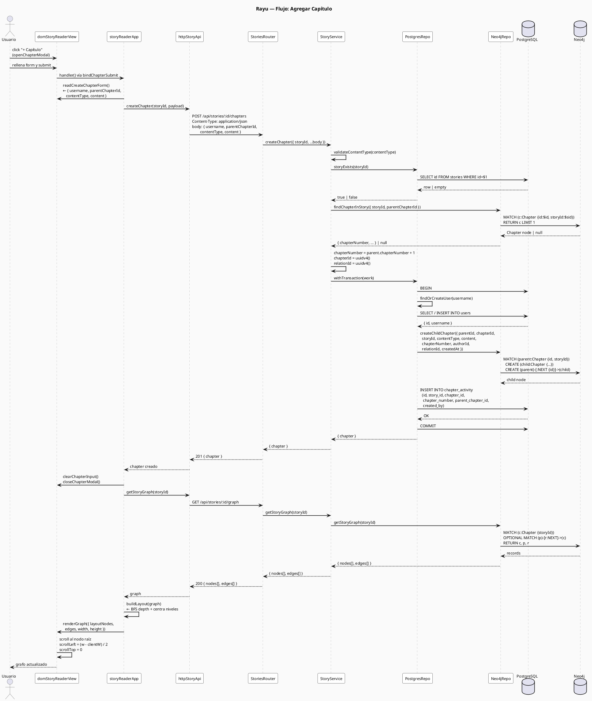
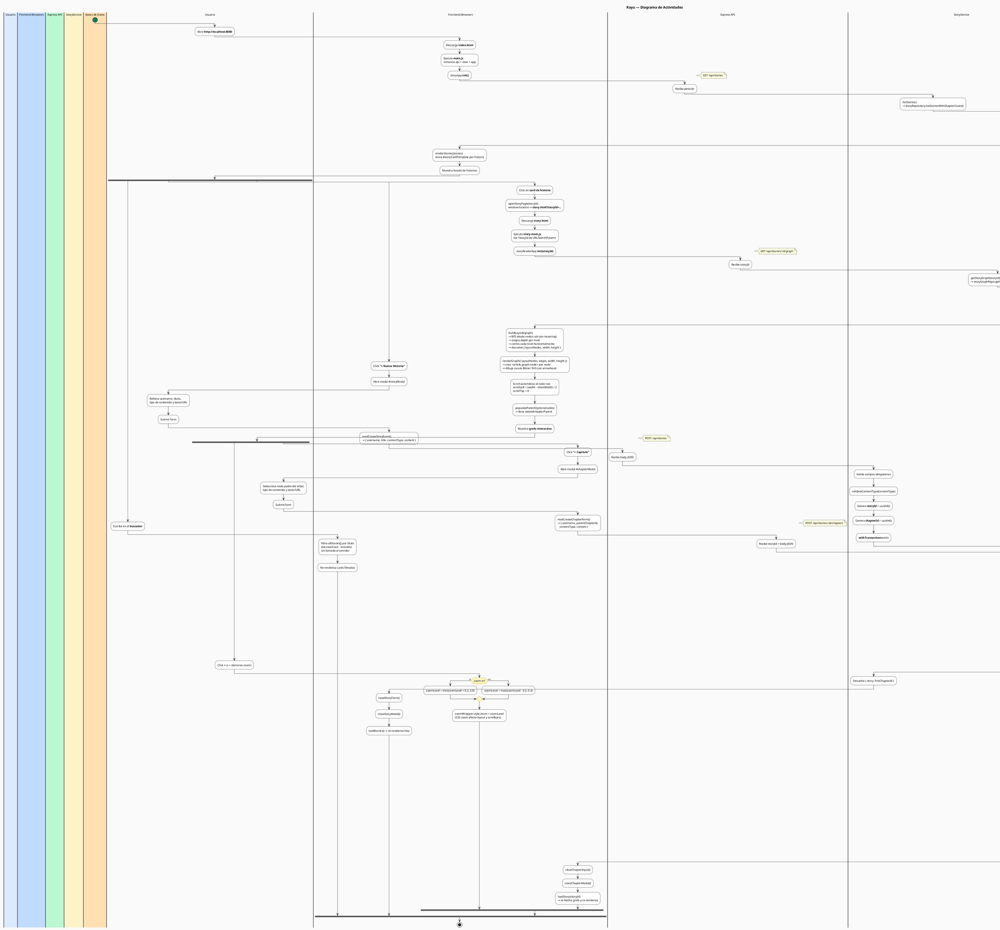
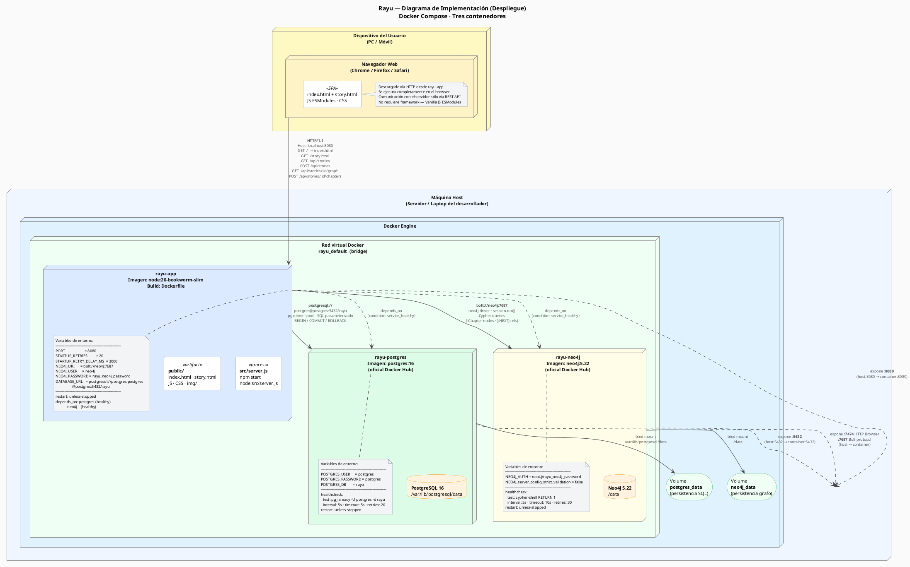

# Rayu — Arquitectura de Componentes

> Renderizar con: [PlantUML Online](https://www.plantuml.com/plantuml/uml/) · VSCode extension **PlantUML** · IntelliJ plugin **PlantUML Integration**

```plantuml
@startuml Rayu_Componentes
skinparam componentStyle rectangle
skinparam defaultFontName "Segoe UI"
skinparam defaultFontSize 11
skinparam backgroundColor #FAFAFA
skinparam shadowing false
skinparam ArrowColor #444444
skinparam ArrowFontSize 9
skinparam ArrowFontColor #555555

skinparam component {
  BackgroundColor #FFFFFF
  BorderColor #888888
  FontColor #111111
}
skinparam interface {
  BackgroundColor #FFF9C4
  BorderColor #F9A825
  FontColor #5D4037
  FontSize 10
}
skinparam package {
  FontStyle bold
  FontSize 12
}
skinparam note {
  BackgroundColor #F3F4F6
  BorderColor #9CA3AF
  FontSize 9
}
skinparam database {
  BackgroundColor #FFF3E0
  BorderColor #FB8C00
  FontColor #333333
}

title Rayu — Diagrama de Componentes UML\n(Microhistorias Colaborativas)

' ╔══════════════════════════════════════════════════════════════╗
' ║  FRONTEND                                                    ║
' ╚══════════════════════════════════════════════════════════════╝
package "Frontend — Browser" #EFF6FF {

  package "Páginas HTML" #DBEAFE {
    component [index.html] as IndexHTML <<page>>
    component [story.html] as StoryHTML <<page>>
  }

  package "Entry Points" #DBEAFE {
    component [main.js] as MainJS <<entrypoint>>
    component [story-main.js] as StoryMainJS <<entrypoint>>

    note right of StoryMainJS
      Lee ?storyId de URLSearchParams
      e instancia: api + view + app
    end note
  }

  ' ── Puertos (interfaces) que el Application Layer requiere ──
  interface "IStoryApi" as IStoryApi
  note top of IStoryApi
    listStories() : Story[]
    createStory(payload) : Result
    getStoryGraph(storyId) : Graph
    createChapter(storyId, payload) : Result
  end note

  interface "IStoryView" as IStoryView
  note top of IStoryView
    renderStories(stories, selected, onOpen)
    renderStoryDetail(story, graph)
    populateParentOptions(graph)
    drawGraph(graph)
    openStoryPage(storyId)
    readCreateStoryForm() : Payload
    readCreateChapterForm() : Payload
    bindStorySubmit(handler)
    bindChapterSubmit(handler)
    resetStoryForm()
    clearChapterInput()
    showSuccess(msg) / showError(msg)
  end note

  interface "IStoryReaderView" as IStoryReaderView
  note top of IStoryReaderView
    setStoryHeader(story, chapterCount)
    showEmptyState()
    renderGraph({ layoutNodes, edges, w, h })
    populateParentOptions(nodes)
    bindChapterSubmit(handler)
    readCreateChapterForm() : Payload
    clearChapterInput()
    applyZoom(level)
    showSuccess(msg) / showError(msg)
    showLoadError(msg)
  end note

  package "Application Layer" #BFDBFE {
    component [storyApp] as StoryApp <<application>>
    note right of StoryApp
      init()
        bindStorySubmit → handleCreateStory
        bindChapterSubmit → handleCreateChapter
        loadStories()
      loadStories()
        api.listStories()
        view.renderStories()
      handleCreateStory()
        view.readCreateStoryForm()
        api.createStory(payload)
        view.resetStoryForm()
        loadStories()
      handleCreateChapter()
        view.readCreateChapterForm()
        api.createChapter(selectedStory.id, payload)
        loadStories() + loadGraph()
      handleOpenStoryPage(story)
        view.openStoryPage(story.id)
    end note

    component [storyReaderApp] as StoryReaderApp <<application>>
    note right of StoryReaderApp
      init(storyId)
        bindChapterSubmit → handleCreateChapter
        loadStory(storyId)
      loadStory(storyId)
        api.getStoryGraph(storyId)
        api.listStories()  ← busca metadata
        buildLayout(graph) ← calcula posiciones
        view.renderGraph(layout)
        view.populateParentOptions(nodes)
      buildLayout(graph)
        BFS desde raíces
        asigna depth a cada nodo
        centra cada nivel horizontalmente
        devuelve { layoutNodes, width, height }
      handleCreateChapter()
        view.readCreateChapterForm()
        api.createChapter(storyId, payload)
        view.clearChapterInput()
        loadStory(storyId)
    end note
  }

  package "Adapters" #E0F2FE {
    component [httpStoryApi] as HttpApi <<adapter>>
    note bottom of HttpApi
      Implementa IStoryApi sobre fetch()
      ─────────────────────────────
      requestJson(url, options)
        fetch + Content-Type: application/json
        lanza Error si !response.ok
      listStories()   GET  /api/stories
      createStory()   POST /api/stories
      getStoryGraph() GET  /api/stories/:id/graph
      createChapter() POST /api/stories/:id/chapters
    end note

    component [domStoryView] as DomView <<adapter>>
    note bottom of DomView
      Implementa IStoryView sobre el DOM de index.html
      ─────────────────────────────
      renderStories()
        clona #storyCardTemplate por historia
        filtra por #storySearch (búsqueda local)
        guarda allStories para re-filtrar
      openStoryModal() / closeStoryModal()
        toggle .hidden en #storyModal
      drawGraph(graph)
        dibuja círculos y líneas en SVG #graph
        posiciona nodos con sin() para ondular
    end note

    component [domStoryReaderView] as DomReaderView <<adapter>>
    note bottom of DomReaderView
      Implementa IStoryReaderView sobre el DOM de story.html
      ─────────────────────────────
      renderGraph({ layoutNodes, edges, width, height })
        limpia nodesLayer y edgesLayer
        crea <article class="graph-node"> por nodo
        dibuja curvas Bézier cúbicas SVG (arrowhead)
        scrollLeft = (width - clientWidth) / 2
        scrollTop = 0  ← centra nodo raíz
      applyZoom(level)
        zoomWrapper.style.zoom = level
        (CSS zoom afecta layout y scrollbars)
      Zoom: STEP=0.2 · MIN=0.3 · MAX=2.0
    end note
  }

  package "Domain — funciones puras" #EDE9FE {
    component [storyDomain] as StoryDomain <<domain>>
    note right of StoryDomain
      escapeHtml(value)
        reemplaza & < > " '
      displayContent(contentType, content)
        "image" → <img src=...>
        "text"  → <p>...</p>
      sortChaptersByNumber(nodes)
        ordena por chapterNumber ASC
    end note
  }
}

' ╔══════════════════════════════════════════════════════════════╗
' ║  BACKEND                                                     ║
' ╚══════════════════════════════════════════════════════════════╝
package "Backend — Node.js / Express" #ECFDF5 {

  component [server.js] as ServerJS <<entrypoint>>
  note right of ServerJS
    dotenv.config()
    PORT = process.env.PORT || 3000
    STARTUP_RETRIES, STARTUP_RETRY_DELAY_MS
    bootstrapApp({ port, retries, delayMs })
    maneja SIGINT / SIGTERM → shutdown()
  end note

  component [bootstrap] as Bootstrap <<infrastructure>>
  note right of Bootstrap
    bootstrapApp(port)
      initializeDatabasesWithRetry()
        loop retries: initNeo4j() + initPostgres()
      createContainer()
      createHttpApp({ storyService })
      app.listen(port)
    closeResources()
      driver.close()
      pool.end()
  end note

  component [createHttpApp] as HttpApp <<infrastructure>>
  note right of HttpApp
    express.json({ limit: "2mb" })
    express.static("public/")
    GET /api/health → { status: "ok" }
    app.use("/api", StoriesRouter)
    error handler global → 500
  end note

  component [StoriesRouter] as Router <<controller>>
  note right of Router
    GET  /api/stories
      → storyService.listStories()
      ← { stories: Story[] }
    POST /api/stories
      body: { username, title, contentType, content }
      → storyService.createStory(body)
      ← 201 { story, firstChapterId }
    GET  /api/stories/:storyId/graph
      → storyService.getStoryGraph(id)
      ← { nodes: Chapter[], edges: Edge[] }
    POST /api/stories/:storyId/chapters
      body: { username, parentChapterId, contentType, content }
      → storyService.createChapter({ storyId, ...body })
      ← 201 { chapter }
  end note

  component [Container] as Container <<infrastructure>>
  note right of Container
    createPostgresStoryRepository({ pool })
    createNeo4jStoryGraphRepository({ driver })
    createStoryService({
      storyRepository,
      storyGraphRepository,
      idGenerator: uuidv4,
      now: () => new Date()
    })
  end note

  ' ── Puertos que StoryService requiere ──
  interface "IStoryRepository" as IStoryRepo
  note bottom of IStoryRepo
    listStoriesWithChapterCount() : Story[]
    storyExists(storyId) : boolean
    withTransaction(work) : any
      [tx] findOrCreateUser(username) : User
      [tx] insertStory(params)
      [tx] insertChapterActivity(params)
  end note

  interface "IStoryGraphRepository" as IGraphRepo
  note bottom of IGraphRepo
    createRootChapter(params)
    createChildChapter(params)
    getStoryGraph(storyId) : { nodes, edges }
    findChapterInStory({ storyId, chapterId })
  end note

  package "Application Layer" #BBFDE8 {
    component [StoryService] as Service <<application>>
    note right of Service
      listStories()
        storyRepository.listStoriesWithChapterCount()
      createStory({ username, title, contentType, content })
        validateContentType()
        idGenerator() × 2  ← storyId + chapterId
        withTransaction:
          findOrCreateUser(username)
          insertStory(storyId, ...)
          storyGraphRepo.createRootChapter(chapterId, ...)
          insertChapterActivity(chapterNumber=1)
      getStoryGraph(storyId)
        storyGraphRepo.getStoryGraph(storyId)
      createChapter({ storyId, username, parentChapterId, ... })
        validateContentType()
        storyRepository.storyExists(storyId)
        storyGraphRepo.findChapterInStory(storyId, parentId)
        chapterNumber = parent.chapterNumber + 1
        withTransaction:
          findOrCreateUser(username)
          storyGraphRepo.createChildChapter(...)
          insertChapterActivity(chapterNumber)
    end note
  }

  package "Infrastructure — Repositories" #D1FAE5 {
    component [PostgresStoryRepository] as PGRepo <<repository>>
    note right of PGRepo
      listStoriesWithChapterCount()
        JOIN stories + users + chapter_activity
        COALESCE(chapter_count, 0)
        ORDER BY created_at DESC LIMIT 50
      storyExists(storyId)
        SELECT id FROM stories WHERE id=$1
      withTransaction(work)
        pool.connect()
        BEGIN / work(txRepo) / COMMIT
        ROLLBACK on error
        client.release()
    end note

    component [Neo4jStoryGraphRepository] as Neo4jRepo <<repository>>
    note right of Neo4jRepo
      createRootChapter(params)
        CREATE (:Chapter { id, storyId, contentType,
          content, chapterNumber:1, authorId, createdAt })
      createChildChapter(params)
        MATCH (parent:Chapter {id, storyId})
        CREATE (child:Chapter {...})
        CREATE (parent)-[:NEXT {id, createdAt}]->(child)
      getStoryGraph(storyId)
        MATCH (c:Chapter {storyId})
        OPTIONAL MATCH (parent)-[r:NEXT]->(c)
        RETURN c, parent, r
      findChapterInStory(storyId, chapterId)
        MATCH (c:Chapter {id, storyId}) RETURN c LIMIT 1
    end note
  }
}

' ╔══════════════════════════════════════════════════════════════╗
' ║  BASES DE DATOS                                              ║
' ╚══════════════════════════════════════════════════════════════╝
package "Bases de Datos" #FFF3E0 {

  database "PostgreSQL" as PG
  note right of PG
    users
      id UUID PK
      username VARCHAR UNIQUE
    stories
      id UUID PK
      title TEXT
      content_type VARCHAR
      cover_content TEXT
      created_by UUID FK→users
      created_at TIMESTAMP
    chapter_activity
      id UUID PK
      story_id UUID FK→stories
      chapter_id UUID
      chapter_number INT
      parent_chapter_id UUID NULL
      created_by UUID FK→users
  end note

  database "Neo4j" as Neo4j
  note right of Neo4j
    Nodo :Chapter
      id           String
      storyId      String
      contentType  String  (text|image)
      content      String
      chapterNumber Integer
      parentChapterId String NULL
      authorId     String
      createdAt    DateTime
    Relación [:NEXT]
      id           String
      createdAt    DateTime
    Cypher: (parent)-[:NEXT]->(child)
  end note
}

' ╔══════════════════════════════════════════════════════════════╗
' ║  CONEXIONES                                                  ║
' ╚══════════════════════════════════════════════════════════════╝

' — Páginas → Entry Points —
IndexHTML  --> MainJS      : <script type=module>
StoryHTML  --> StoryMainJS : <script type=module>

' — Entry Points → instancias —
MainJS     --> HttpApi     : createHttpStoryApi()
MainJS     --> DomView     : createDomStoryView()
MainJS     --> StoryApp    : createStoryApp({ storyApi, view })

StoryMainJS --> HttpApi       : createHttpStoryApi()
StoryMainJS --> DomReaderView : createDomStoryReaderView()
StoryMainJS --> StoryReaderApp : createStoryReaderApp({ storyApi, view })

' — Implementaciones de puertos —
HttpApi      ..|> IStoryApi       : implements
DomView      ..|> IStoryView      : implements
DomReaderView ..|> IStoryReaderView : implements

' — Application usa puertos —
StoryApp       ..> IStoryApi       : requires
StoryApp       ..> IStoryView      : requires
StoryReaderApp ..> IStoryApi       : requires
StoryReaderApp ..> IStoryReaderView : requires

' — Adapters DOM usan Domain —
DomView       --> StoryDomain : escapeHtml()\ndisplayContent()\nsortChaptersByNumber()
DomReaderView --> StoryDomain : escapeHtml()\ndisplayContent()

' — HTTP: Frontend → Backend —
HttpApi --> Router : HTTP/1.1 JSON\nfetch(url, { headers, body })\nthrows Error si !response.ok

' — Bootstrap —
ServerJS  --> Bootstrap  : bootstrapApp(port)\nSIGINT/SIGTERM → shutdown()
Bootstrap --> Container  : createContainer()
Bootstrap --> HttpApp    : createHttpApp({ storyService })
Bootstrap ..> PG         : initPostgres() con reintentos\npg pool.connect()
Bootstrap ..> Neo4j      : initNeo4j() con reintentos\ndriver.verifyConnectivity()

' — HTTP App —
HttpApp --> Router : app.use("/api", router)\nexpress.static("public/")

' — Router → Service —
Router --> Service : listStories()\ncreateStory(body)\ngetStoryGraph(storyId)\ncreateChapter({ storyId, ...body })

' — Container inyecta —
Container --> PGRepo   : new({ pool })
Container --> Neo4jRepo : new({ driver })
Container --> Service  : new({ storyRepository: PGRepo,\nstoryGraphRepository: Neo4jRepo,\nidGenerator: uuidv4,\nnow: ()=>new Date() })

' — Implementaciones de puertos backend —
PGRepo   ..|> IStoryRepo  : implements
Neo4jRepo ..|> IGraphRepo  : implements

' — Service usa puertos —
Service ..> IStoryRepo  : storyRepository.*
Service ..> IGraphRepo  : storyGraphRepository.*

' — Repos → Bases de Datos —
PGRepo   --> PG    : pool.query(SQL)\nparameterized $1..$n\npg npm driver
Neo4jRepo --> Neo4j : session.run(Cypher)\nparámetros nombrados\nneo4j-driver npm

@enduml
```

---

## Flujo de datos — Crear capítulo (punta a punta)

---

## Diagrama de Actividades

---

## Diagrama de Implementación (Despliegue)

